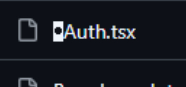
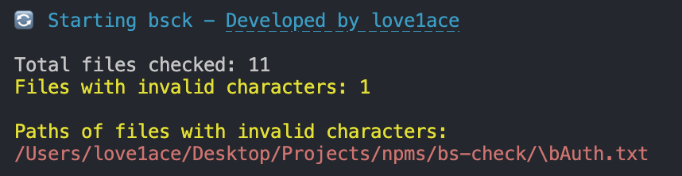
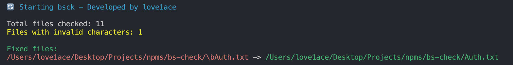

# bsck

**bsck** is a tool that checks and removes `\b` and `^H` from file names.





## Quick Start

Get **bsck** up and running quickly!

- `npx bsck`: Scans your project files for filenames containing `\b` and `^H`.
- `npx bsck --fix`: Scans and automatically removes the `\b` and `^H` characters from file names.

1. **Run**:
    ```bash
    npx bsck
    ```
    
    
    ```bash
    npx bsck --fix
    ```
    


2. **Done!**

## Contributing

We welcome contributions to **bsck**! Whether it's reporting a bug, suggesting an enhancement, or submitting a pull request, your input is valued.

## License

This project is licensed under the MIT License - see the [LICENSE](LICENSE) file for details.

## Contact

For any questions, suggestions, or feedback, please contact [love1ace](mailto:lovelacedud@gmail.com).
